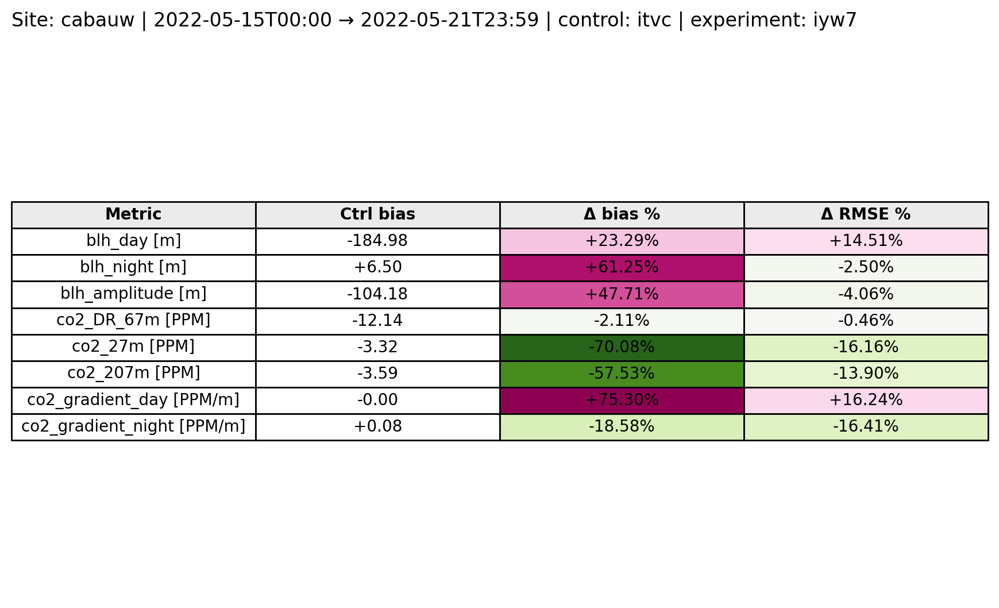
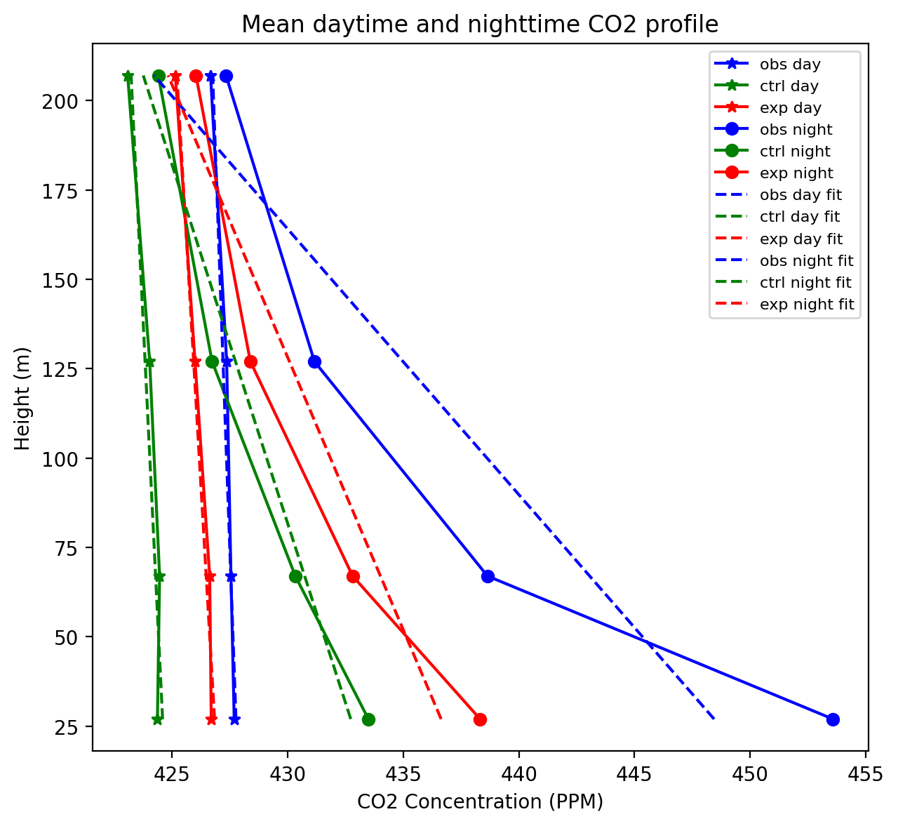

# CATRINE Scorecard

This repository computes a small set of CATRINE “scorecard” metrics comparing a **control** run vs an **experiment** run against **observations** for a given site and time window.

The main output is:
- a table printed in the terminal
- an optional table output file (`.csv` or `.json`) if `out` is set in the spec
- a **scorecard PNG**
- a few diagnostic **PNG plots**

## Repository layout

- `scorecard_spec.example.json`
  - Example spec showing all keys accepted by `scripts/compute_scorecard.py`.
- `requirements.txt`
  - Python dependencies for running the scorecard.
- `scripts/compute_scorecard.py`
  - CLI entrypoint. Loads datasets, runs selected metrics, prints a table, and saves figures.
- `scripts/sites.json`
  - Site metadata (lat/lon, observation subdir/name, tower levels).

Code modules:
- `scripts/scorecard_core.py`
  - Reusable helpers: time alignment, day/night selection, bias/RMSE deltas, vertical gradients, and data loading.
- `scripts/scorecard_metrics.py`
  - Metric implementations only (functions like `metric_blh_day`, `metric_co2_vertical_gradient`, ...).
- `scripts/scorecard_metric_registry.py`
  - Defines the **default metric list** and allows selection by name.
- `scripts/scorecard_plots.py`
  - Plotting utilities. Saves all figures as `.png`.

## Environment setup

A working Python environment needs the packages listed in `requirements.txt`.

Create and activate a virtual environment (example using `venv`):

```bash
python3 -m venv .venv
source .venv/bin/activate
pip install --upgrade pip
pip install -r requirements.txt
```

## Configure the spec

Start from `scorecard_spec.example.json` (copy it and edit values), e.g.:

- `site`: must exist in `scripts/sites.json`
- `data_root`: where model NetCDF files live
- `dir_obs`: where observation files live
- `fig_dir`: output directory for PNGs (default: `figures/` under repo root)

## Expected input files

The loader functions in `scripts/scorecard_core.py` currently cannot extract data from MARS and expect the following inputs.

### Model files (from `data_root`)

For each run ID (`control` and `experiment`) and `site`, the code looks for:

- **BLH surface file(s)**
  - Pattern: `{data_root}/{run_id}_*_srf_t0_{site}.nc`
  - Must contain variable: `blh`
  - Must have a `time` coordinate.

- **CO2 profile file(s)**
  - Pattern: `{data_root}/{run_id}_*_z_t0_{site}.nc`
  - Must contain variable: `co2`
  - Must have coordinates `time` and `height`.
  - The CO2 profiles are interpolated to the tower levels defined in `scripts/sites.json` under `levels`.

If multiple files match a pattern, they are opened together (by coordinates).

### Observation files (from `dir_obs`)

- **BLH observations**
  - Path: `{dir_obs}/{obs_subdir}/{obs_name}.nc`
  - `obs_subdir` and `obs_name` come from `scripts/sites.json` for the selected site.
  - Must contain variable: `MLH`
  - Must have a `time` coordinate.

- **CO2 observations (tower CSV)**
  - Folder: `{dir_obs}/{obs_subdir}/`
  - The code picks the first file matching: `*CO2*.csv`
  - The first column must be time and is renamed to `time`.
  - For each height in `levels` (from `scripts/sites.json`), the CSV must contain a column:
    - `co2_{level}m` (examples: `co2_27m`, `co2_67m`, ...)

### Site configuration (`scripts/sites.json`)

The selected site entry should define:
- `obs_subdir` (subfolder under `dir_obs`)
- `obs_name` (BLH NetCDF base name)
- `levels` (tower heights in meters, e.g. `[27, 67, 127, 207]`)

## Run
From the repository root:

```bash
python scripts/compute_scorecard.py scorecard_spec.json
```

### List available metrics
```bash
python scripts/compute_scorecard.py --list-metrics
```

### Run only selected metrics
```bash
python scripts/compute_scorecard.py --metrics blh_day,co2_27m
```

### Skip writing figures
```bash
python scripts/compute_scorecard.py --no-figures
```

## Outputs

### Scorecard PNG

Example scorecard:



Saved in `fig_dir` (default: `figures/` under the repo root) with the exact naming pattern:

- `scorecard_{site}_{ctrl}_{exp}_{start_date}.png`

Where `start_date` is derived from `start` formatted as `YYYYMMDD`.

### Diagnostic PNG plots

Example:



Also saved in `fig_dir` (filenames include `{site}_{ctrl}_{exp}_{start_date}`).

### Optional score table file

If `out` is set in the spec, a table file is written:
- `.csv` if `out` ends with `.csv` (or has no extension)
- `.json` if `out` ends with `.json`

## Adding a new metric

1. Add a new function in `scripts/scorecard_metrics.py` (keep it small and reuse helpers from `scripts/scorecard_core.py`).
2. Register it in `scripts/scorecard_metric_registry.py` by adding a `Metric(...)` entry to the returned list.
3. (Optional) Add a diagnostic plot in `scripts/scorecard_plots.py` if the metric benefits from a visual check.
